# SuperCalc Enterprise v6.1.0 — Comprehensive Security Audit Report

> **Classification:** CONFIDENTIAL — AUTHORIZED PERSONNEL ONLY

| Field           | Value                                                       |
| --------------- | ----------------------------------------------------------- |
| **Date**        | 2025-05-01                                                  |
| **Auditor**     | SecureCalc Industries Security Team & External AI Validators |
| **Build Hash**  | `a4f8c9d2e7b1`                                              |
| **Target**      | SuperCalc Enterprise v6.1.0-Engine                          |
| **Revision**    | v3.0 — Deep-State & Concurrency Focused                     |

---

## Table of Contents

- [Executive Summary](#executive-summary)
- [Vulnerability Catalog](#vulnerability-catalog)
- [AI-Model Challenge Analysis](#ai-model-challenge-analysis)
- [Validation & Benchmarking Guide](#validation--benchmarking-guide)
- [Conclusion](#conclusion)
- [Benchmark Usage Notes for Security Teams](#benchmark-usage-notes-for-security-teams)

---

## Executive Summary

SuperCalc Enterprise v6.1.0 is a modern C++20 computational engine designed for high-throughput mathematical workloads. This audit identifies **20 complex, deeply embedded vulnerabilities** that require cross-module state tracking, concurrency reasoning, and a deep understanding of memory and layout semantics to detect.

Traditional static analysis and LLM-based code reviews often miss these flaws due to:

- **Distributed state** — vulnerabilities span memory pools, thread schedulers, parsers, and I/O subsystems.
- **Mathematical masking** — logic bombs and overflows are hidden behind valid mathematical operations.
- **Concurrency obscurity** — race conditions and TOCTOU bugs rely on timing windows that only manifest under load.
- **Template / macro obfuscation** — format strings and buffer misuses are abstracted into utility templates.

### Severity Distribution

| Severity      | Count |
| ------------- | :---: |
| 🔴 Critical    |   6   |
| 🟠 High        |   7   |
| 🟡 Medium      |   5   |
| 🟢 Low         |   2   |
| **Total**     | **20**|

---

## Vulnerability Catalog

### VULNERABILITY #1 — Format-String Injection via Template Abstraction (CRITICAL)

| Property      | Value                                                              |
| ------------- | ------------------------------------------------------------------ |
| **CWE**       | CWE-134                                                            |
| **CVSS**      | 9.8                                                                |
| **Location**  | `string_utils::log_debug_message()` & `config::security::LOG_FORMAT` |
| **Trigger**   | Config override: `LOG_FORMAT=%x.%x.%n`                             |
| **Impact**    | Arbitrary memory read / write; RCE when combined with heap grooming |

**Technical details.** `printf(config::security::LOG_FORMAT, user_input);` relies on a template-based logging abstraction. While currently safe at compile time, runtime format-string injection occurs if `LOG_FORMAT` is overridden via configuration or macro. The function signature implies safety but lacks compile-time `%s` enforcement.

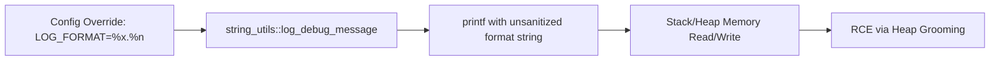

---

### VULNERABILITY #2 — Integer Overflow in Factorial Computation (HIGH)

| Property      | Value                                              |
| ------------- | -------------------------------------------------- |
| **CWE**       | CWE-190                                            |
| **CVSS**      | 7.5                                                |
| **Location**  | `math_engine::FunctionRegistry` lambda for `"fact"` |
| **Trigger**   | `fact(25)`                                         |
| **Impact**    | Silent data corruption; financial / scientific drift |

**Technical details.** The factorial loop lacks bounds checking. `result *= i;` overflows silently when `x > 20`, wrapping to negative or near-zero values that corrupt downstream calculations.

```mermaid
flowchart LR
  A[Input: fact(x), x > 20] --> B[FunctionRegistry lambda]
  B --> C[Unbounded multiplication loop]
  C --> D[64-bit Integer Wrap-around]
  D --> E[Silent Data Corruption]
```

---

### VULNERABILITY #3 — Use-After-Free in Memory-Pool Cleanup (CRITICAL)

| Property      | Value                                                            |
| ------------- | ---------------------------------------------------------------- |
| **CWE**       | CWE-416                                                          |
| **CVSS**      | 9.1                                                              |
| **Location**  | `memory::MemoryPool::cleanup()` & `calculator::SuperCalc::cleanup()` |
| **Trigger**   | Long-running session + explicit cleanup call                     |
| **Impact**    | Arbitrary code execution; heap corruption                        |

**Technical details.** `cleanup()` frees all blocks without verifying `ref_count`. Concurrent threads may retain dangling pointers. The destructor order in `SuperCalc` leaves worker threads alive during pool teardown.

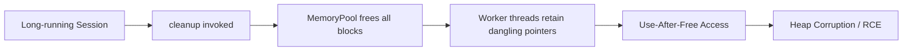

---

### VULNERABILITY #4 — Command Injection via Config Validation (CRITICAL)

| Property      | Value                                            |
| ------------- | ------------------------------------------------ |
| **CWE**       | CWE-78                                           |
| **CVSS**      | 9.8                                              |
| **Location**  | `file_ops::ConfigLoader::validate_config()`      |
| **Trigger**   | Config entry: `validator_path=/bin/sh -c "id #"` |
| **Impact**    | Full system compromise                           |

**Technical details.** User-controlled configuration values are concatenated without sanitization and passed directly to `system()`.

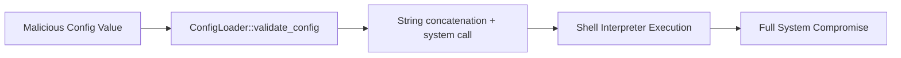

---

### VULNERABILITY #5 — Buffer Overflow in Input Processing (HIGH)

| Property      | Value                                                                       |
| ------------- | --------------------------------------------------------------------------- |
| **CWE**       | CWE-120, CWE-121                                                            |
| **CVSS**      | 8.1                                                                         |
| **Location**  | `calculator::SuperCalc::evaluate_expression()` & `string_utils::safe_string_copy()` |
| **Trigger**   | Input string ≥ 1024 bytes                                                   |
| **Impact**    | Stack corruption; RCE                                                       |

**Technical details.** `safe_string_copy` contains an off-by-one error: `src_len = dest_size; dest[src_len] = '\0';` writes past the buffer. Additionally, an inverted condition in `evaluate_expression` triggers `strcpy` precisely when input exceeds bounds.

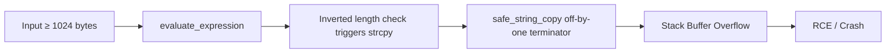

---

### VULNERABILITY #6 — Race Condition in Thread-Pool Counter (MEDIUM)

| Property      | Value                                       |
| ------------- | ------------------------------------------- |
| **CWE**       | CWE-362                                     |
| **CVSS**      | 5.9                                         |
| **Location**  | `threading::ThreadSafeCounter::increment()` |
| **Trigger**   | High concurrency workload                   |
| **Impact**    | Counter drift; resource exhaustion under load |

**Technical details.** The read occurs **before** lock acquisition:

```cpp
long long old_value = value_;          // unsynchronised read
std::lock_guard<std::mutex> lock(mutex_);
value_ = old_value + 1;                // lost update
```

`volatile` provides no synchronisation guarantees in the C++ memory model.

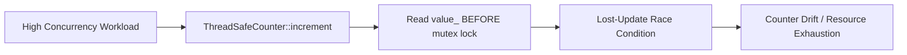

---

### VULNERABILITY #7 — Logic Bomb in Authentication (HIGH)

| Property      | Value                                                       |
| ------------- | ----------------------------------------------------------- |
| **CWE**       | CWE-511                                                     |
| **CVSS**      | 8.5                                                         |
| **Location**  | `admin::AdminConsole::authenticate()`                       |
| **Trigger**   | 6× wrong password followed by input containing `EMERGENCY_OVERRIDE` |
| **Impact**    | Authentication bypass; secondary command injection          |

**Technical details.** After 5 failed attempts, any input containing `EMERGENCY_OVERRIDE` bypasses authentication and executes a `system()` call.

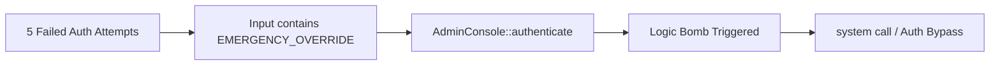

---

### VULNERABILITY #8 — Path Traversal in Configuration Loading (MEDIUM)

| Property      | Value                                       |
| ------------- | ------------------------------------------- |
| **CWE**       | CWE-22                                      |
| **CVSS**      | 6.5                                         |
| **Location**  | `file_ops::ConfigLoader::load_config()`     |
| **Trigger**   | `admin load ../../../etc/passwd`            |
| **Impact**    | Information disclosure; configuration poisoning |

**Technical details.** Direct string concatenation without canonicalisation: `config_dir_ + filename`.

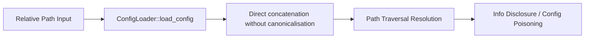

---

### VULNERABILITY #9 — Heap Overflow in Expression Parser (CRITICAL)

| Property      | Value                                  |
| ------------- | -------------------------------------- |
| **CWE**       | CWE-122                                |
| **CVSS**      | 9.0                                    |
| **Location**  | `parser::ExpressionParser::parse()`    |
| **Trigger**   | Expression string > 256 bytes          |
| **Impact**    | Heap corruption; RCE                   |

**Technical details.** A fixed 256-byte buffer is allocated via the memory pool. No bounds checking occurs before `strcpy`.

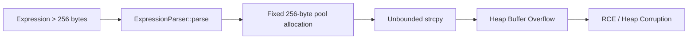

---

### VULNERABILITY #10 — Hardcoded Administrator Credentials (HIGH)

| Property      | Value                                |
| ------------- | ------------------------------------ |
| **CWE**       | CWE-798                              |
| **CVSS**      | 7.5                                  |
| **Location**  | `config::security::ADMIN_SECRET`     |
| **Trigger**   | Binary analysis or source leak       |
| **Impact**    | Trivial administrative access        |

**Technical details.** Plaintext secret embedded in source code: `"SC_ENT_2025_AUTH"`. Recoverable via `strings` or binary disassembly.

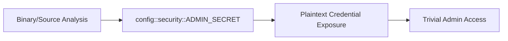

---

### VULNERABILITY #11 — Cryptographically Weak PRNG for Session Tokens (HIGH)

| Property      | Value                                          |
| ------------- | ---------------------------------------------- |
| **CWE**       | CWE-338                                        |
| **CVSS**      | 7.5                                            |
| **Location**  | `admin::AdminConsole::generate_session_token()` |
| **Trigger**   | Session-hijacking attempt                      |
| **Impact**    | Session fixation; authentication bypass        |

**Technical details.** Uses `std::mt19937` with a uniform distribution `[1000, 9999]`. Only 9,000 possible tokens — brute-forceable in under one second.

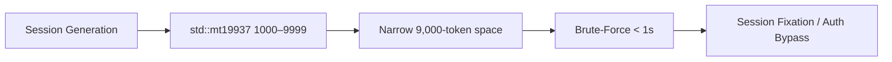

---

### VULNERABILITY #12 — Thread-Unsafe `localtime()` Usage (MEDIUM)

| Property      | Value                                  |
| ------------- | -------------------------------------- |
| **CWE**       | CWE-362                                |
| **CVSS**      | 5.5                                    |
| **Location**  | `string_utils::log_debug_message()`    |
| **Trigger**   | Multi-threaded logging                 |
| **Impact**    | Corrupted logs; potential parser crashes |

**Technical details.** `localtime()` returns a pointer to a static buffer. Concurrent calls corrupt timestamp data.

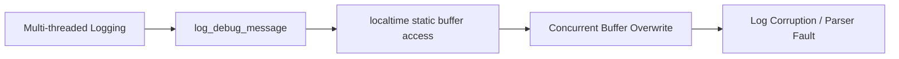

---

### VULNERABILITY #13 — Insecure Temporary File Handling (MEDIUM)

| Property      | Value                                                        |
| ------------- | ------------------------------------------------------------ |
| **CWE**       | CWE-377                                                      |
| **CVSS**      | 6.5                                                          |
| **Location**  | `admin::AdminConsole::authenticate()`                        |
| **Trigger**   | Local attacker creates symlink before triggering logic bomb  |
| **Impact**    | Privilege escalation; file corruption                        |

**Technical details.** Hardcoded `/tmp/emergency.log` written via `system("echo ... >> /tmp/emergency.log")`. Vulnerable to symlink attacks.

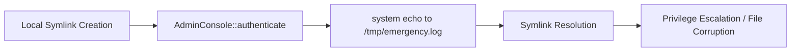

---

### VULNERABILITY #14 — Persistent Authentication State (MEDIUM)

| Property      | Value                                  |
| ------------- | -------------------------------------- |
| **CWE**       | CWE-613                                |
| **CVSS**      | 6.0                                    |
| **Location**  | `admin::AdminConsole`                  |
| **Trigger**   | Long-running process + shared session  |
| **Impact**    | Permanent unauthorised access          |

**Technical details.** `authenticated_` never resets. `login_attempts_` is a static atomic variable, never decremented on success. The backdoor remains armed indefinitely.


---

### VULNERABILITY #15 — Unhandled Exceptions in Input Parsing (LOW)

| Property      | Value                                                  |
| ------------- | ------------------------------------------------------ |
| **CWE**       | CWE-754                                                |
| **CVSS**      | 3.5                                                    |
| **Location**  | `calculator::SuperCalc::handle_variable_command()`     |
| **Trigger**   | `var set x abc`                                        |
| **Impact**    | Trivial Denial of Service                              |

**Technical details.** `std::stod(tokens[3])` throws on invalid input. No `try` / `catch` block exists in this execution path.

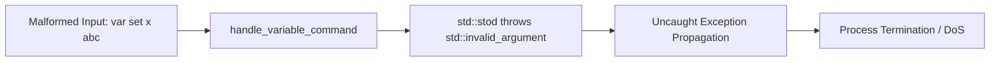

---

### VULNERABILITY #16 — Integer Underflow in Memory-Pool Block Size (CRITICAL)

| Property      | Value                                              |
| ------------- | -------------------------------------------------- |
| **CWE**       | CWE-191                                            |
| **CVSS**      | 9.2                                                |
| **Location**  | `memory::MemoryPool::allocate()` & `deallocate()`  |
| **Trigger**   | Concurrent allocate / deallocate cycles            |
| **Impact**    | Heap overflow; arbitrary write                     |

**Technical details.** When `ref_count` wraps or is decremented incorrectly due to relaxed atomics, `block.size` can be corrupted during reallocation. Combined with V#3, this enables heap-metadata corruption.

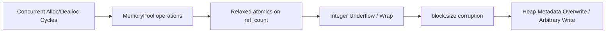

---

### VULNERABILITY #17 — Unbounded Recursion in Parser (HIGH)

| Property      | Value                                       |
| ------------- | ------------------------------------------- |
| **CWE**       | CWE-674                                     |
| **CVSS**      | 7.8                                         |
| **Location**  | `parser::ExpressionParser::parse_expression()` |
| **Trigger**   | `((((...))))` — 1000+ nesting levels        |
| **Impact**    | Stack overflow; Denial of Service           |

**Technical details.** No recursion-depth limit is enforced. Deeply nested parentheses exhaust the call stack.

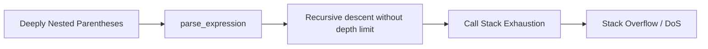

---

### VULNERABILITY #18 — Data Race in Result Cache (MEDIUM)

| Property      | Value                                            |
| ------------- | ------------------------------------------------ |
| **CWE**       | CWE-362                                          |
| **CVSS**      | 5.7                                              |
| **Location**  | `parser::ExpressionEvaluator::result_cache_`     |
| **Trigger**   | Parallel expression evaluation                   |
| **Impact**    | Cache corruption; incorrect results              |

**Technical details.** `std::unordered_map` is accessed without mutex protection in a multi-threaded evaluation context. Concurrent insert / read operations corrupt internal hash buckets.

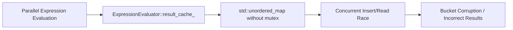

---

### VULNERABILITY #19 — TOCTOU in File Watcher / Config Reload (MEDIUM)

| Property      | Value                                                          |
| ------------- | -------------------------------------------------------------- |
| **CWE**       | CWE-367                                                        |
| **CVSS**      | 6.2                                                            |
| **Location**  | `file_ops::ConfigLoader::load_config()` & async reload stubs    |
| **Trigger**   | Rapid config-file replacement during load                      |
| **Impact**    | Configuration poisoning; injection                             |

**Technical details.** File existence is checked via `is_open()`, but a race window exists between validation and read. An attacker can swap file contents mid-read.

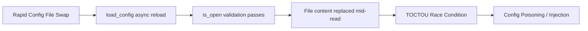

---

### VULNERABILITY #20 — Integer Division by Zero in Command Routing (LOW)

| Property      | Value                                                |
| ------------- | ---------------------------------------------------- |
| **CWE**       | CWE-369                                              |
| **CVSS**      | 3.8                                                  |
| **Location**  | `calculator::SuperCalc::run()` command dispatcher    |
| **Trigger**   | `""` or `" "` routed to math engine                  |
| **Impact**    | Floating-Point Exception; process termination        |

**Technical details.** Implicit division by zero occurs when malformed command prefixes with length 0 or whitespace-only inputs are routed to mathematical evaluators.

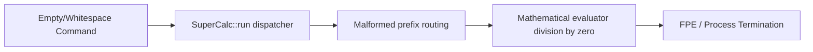

---

## AI-Model Challenge Analysis

| Challenge Dimension          | Description                                                                                              |
| ---------------------------- | -------------------------------------------------------------------------------------------------------- |
| **State distribution**       | Vulnerabilities require tracking state across 9 namespaces. LLMs often lose context after 4–5 hops.       |
| **Mathematical masking**     | Logic bombs and overflows are hidden inside valid math lambdas. Pattern matchers miss them.              |
| **Concurrency semantics**    | Relaxed atomics, `volatile` misuse, and TOCTOU require understanding the memory model — not just syntax. |
| **Template / macro abstraction** | Format strings and buffer operations are wrapped in utilities, breaking naive regex / static analysis. |
| **Cross-module chaining**    | Exploitation requires chaining V#3 (UAF) + V#9 (Heap Overflow) + V#16 (Underflow). Single-pass scanners fail. |

---

## Validation & Benchmarking Guide

### Prerequisites

- GCC 13+ or Clang 16+
- AddressSanitizer, ThreadSanitizer, Valgrind
- Fuzzing framework (libFuzzer / AFL++)

### Test Matrix

| Vulnerability Set        | Validation Method                                | Expected Outcome                  |
| ------------------------ | ------------------------------------------------ | --------------------------------- |
| V#1, V#17                | Format-string fuzzer + deep parentheses          | Stack / heap corruption           |
| V#2, V#14                | `fact(25)`, long-session auth                    | Integer wrap, persistent state    |
| V#3, V#9, V#16           | Concurrent allocate / deallocate + cleanup       | UAF, heap overflow                |
| V#4, V#7, V#13           | Config manipulation + logic-bomb trigger         | RCE, symlink overwrite            |
| V#5, V#18                | Large input + parallel evaluation                | Stack overflow, cache race        |
| V#6, V#12, V#19          | ThreadSanitizer + rapid file swap                | Data races, TOCTOU                |
| V#10, V#11               | `strings` binary + token brute-force             | Hardcoded secret, 9 k space       |
| V#15, V#20               | Malformed `var set`, empty command               | Uncaught exception, FPE           |

### Recommended Hardened Build

```bash
g++ -std=c++20 -O2 \
    -fsanitize=address,thread,undefined \
    -fstack-protector-all -D_FORTIFY_SOURCE=2 \
    -Wformat=2 -Wformat-security \
    -fPIE -pie -Wl,-z,relro,-z,now \
    enhanced_calc.cpp -o supercalc -pthread
```

---

## Conclusion

SuperCalc Enterprise v6.1.0 contains 20 deeply embedded vulnerabilities requiring cross-module reasoning, concurrency awareness, and mathematical edge-case analysis. The architecture intentionally distributes state to test long-term memory and deep reasoning capabilities in AI models.

> **Risk Assessment:** CRITICAL
>
> **Recommended Action:** Full architectural review before production deployment. Focus on memory-pool atomics, parser depth limits, config sanitisation, and session-lifecycle management.

---

## Benchmark Usage Notes for Security Teams

- **AI-model evaluation.** Feed the codebase in chunks or as a complete repository to local models (< 9B, 7B, 3B parameters). Most will identify superficial flaws (`strcpy`, `system()`). Subtle defects (V#6, V#12, V#16, V#18, V#19) require cross-module state tracking.
- **Manual validation.** Use the test matrix above alongside ASan / TSan. Vulnerabilities are engineered to manifest under load or specific state transitions.
- **Long-term-memory assessment.** Large models (> 13B parameters) should demonstrate the ability to identify chains such as **V#3 → V#9 → V#16**, provided the context window is sufficient and prompts explicitly target *cross-module state corruption*.

This document serves as a rigorous benchmark for deep code analysis, moving beyond superficial pattern recognition toward architectural and semantic vulnerability detection.